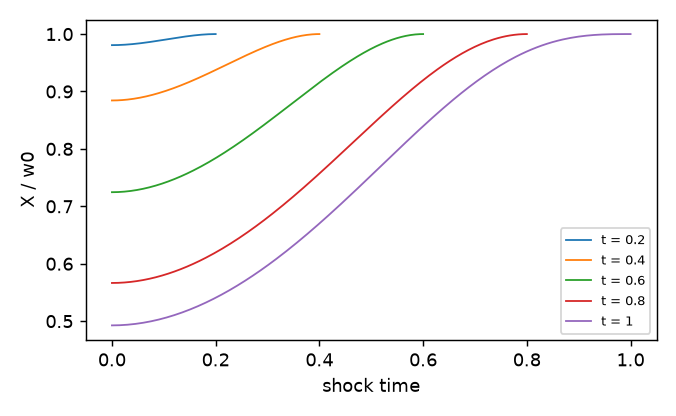

# noisestate

Equilibrium solver for linear-quadratic-Gaussian games with private information.  You describe the model
as data (a YAML file or a few lines of Python) and the solver returns the equilibrium in noise-state
linear strategies: every agent's action as a kernel over the primitive shocks, its raw strategy on its
own signal history, and the decomposition of each first-order condition into the instantaneous part,
the physical continuation and the information wedge.  The framework is the decentralized LQG game of
*Forecasting and Manipulating the Forecasts of Others* (Babichenko, 2026): a linear state driven by the
agents' controls and Brownian channels, each agent observing noisy linear rows of the states and of the
other agents' controls, possibly with delay, and minimising a discounted (or average) quadratic flow
loss over causal linear strategies on its own observation history.

## Install

```bash
pip install ".[plot]"             # from a checkout of this repository; [plot] adds matplotlib
```

Python >= 3.10.  Dependencies: numpy >= 1.24, scipy >= 1.12, pyyaml; matplotlib for the figures, which
the walkthrough below draws.  MIT licence.  The shipped model files install with the package, so
`ns.example(...)` works from a plain install; the reference data (`tests/refs/`) lives in the
repository only.

## A first game, start to finish

One model, all the way through: what the game is, solving it, reading the answer, and changing it.
Everything below uses `ch1_two_player_finite`, the Chapter 1 tracking game.

### The game

Two players share one state and each watches it through their own noisy signal.  Both want the state
at zero, and both pay for the effort of pushing it there:

```
dX  = (D1 + D2) dt + sigma dW0            one state, moved by both players and by a common shock
dYi = sqrt(pi) X dt + dWi                 player i sees X through its own noise; pi is its precision
player i minimises  E int_0^T (X^2 + ri Di^2) dt
```

That is the whole model, and this is the same model as a file:

```yaml
name: ch1_two_player_finite
params: {p1: 3.0, p2: 3.0, r1: 0.1, r2: 0.1, sigma: 1.0}
channels: [w0, w1, w2]                                   # the Brownian shocks
states:
  X: {drift: {D1: 1.0, D2: 1.0}, noise: {w0: sigma}}     # dX = (D1 + D2) dt + sigma dW0
agents:
  player1:
    controls: [D1]
    signals: {y1: {drift: {X: "sqrt(p1)"}, noise: {w1: 1.0}}}
    loss: [[1.0, X, X], [r1, D1, D1]]                    # X^2 + r1 D1^2
  player2:
    controls: [D2]
    signals: {y2: {drift: {X: "sqrt(p2)"}, noise: {w2: 1.0}}}
    loss: [[1.0, X, X], [r2, D2, D2]]
horizon: {kind: finite, T: 1.0}                          # the game runs on [0, 1]
numerics: {nodes: 12}                                    # how finely it is discretised
```

A loss term is `[coefficient, a, b]` for a quadratic and `[coefficient, a]` for a linear one, so
`[1.0, X, X]` is `X^2` and `[r1, D1, D1]` is `r1 D1^2`.  `params` are named so you can vary them.

### Solve it

```python
import noisestate as ns

model = ns.load(ns.example("ch1_two_player_finite"))
print(model.describe())                   # the equations, the observations, the conventions -- no solve

res = ns.solve(model)
res.require_ok()                          # raises unless the answer is trustworthy; see below
print(res.summary())
```

```
ch1_two_player_finite: converged residual 5.90e-09 in 15 evaluations, 0.9s; triangle grid 1 panels,
1 pieces x 12x12 nodes = 144 nodes on [0, 1.0], rho=0.0
  player1: discounted cost = +0.39690577
  player2: discounted cost = +0.39690577
```

Both players pay the same, which is what you would expect from a game symmetric in `p` and `r`.

### Read the answer

The costs are the headline number, one per agent:

```python
res.costs["player1"]      # 0.39690577   (res.cost_kind: "discounted integral over [0, T]")
```

Underneath them is what the players actually do, and it is worth looking at before trusting any
cost.  A **kernel** is a response to a shock: how much of a unit shock, struck at one moment, is
still showing up later.

```python
res.kernel("X", "w0").plot("kernel.png")     # the state's response to the common shock
```



Each curve is one date `t`; the horizontal axis is the *shock time* `s`, the moment the shock struck.
The distance `t - s` is the shock's **age**.  Reading one curve from right to left is watching a
single shock get older:

```python
k = res.kernel("X", "w0")
k.at(1.0, 1.0)      # +1.0000   age 0:    a unit shock moves X one for one, at once
k.at(1.0, 0.5)      # +0.7539   age 0.5:  the players have pushed some of it back
k.at(1.0, 0.0)      # +0.4926   age 1.0:  half of it is still there
```

A positive value means the state is still displaced in the direction of the shock.  The decay is the
players working: without them `X` would keep the whole shock forever, since nothing else pulls it
back.

The controls tell the other half of the story, and their signs are the opposite:

```python
d = res.kernel("D1", "w0")
d.at(0.5, 0.5)      # +0.0000   age 0:  no reaction at all to a shock just struck
d.at(0.5, 0.4)      # -0.2256   age 0.1: player 1 pushes back, against the shock
d.at(1.0, 0.9)      # +0.0000   at t = T there is no horizon left to control
```

Two things to read there.  The reaction at age zero is **exactly zero**: a player learns about `X`
only by integrating a noisy signal, so it cannot respond to a shock the instant it lands.  And the
sign is negative against a positive shock, which is what "push the state back to zero" looks like.

`kernel()` is the *closed-loop* response, the thing you plot.  It is not the strategy the player
runs: that is `res.maps["player1"]`, the weights the player puts on its **own signal history**, which
is what it can actually condition on.  The two answer different questions -- "what happens when a
shock lands" against "what does this player do with what it sees".

### Change one thing

Give player 1 four times the precision and solve again.  Nothing else moves:

```python
sharper = ns.solve(model.with_params(p1=12.0))
sharper.require_ok()
sharper.costs      # player1 0.359950,  player2 0.331103
```

| | `p1 = 3` | `p1 = 12` | |
|---|---|---|---|
| player1 | 0.396906 | 0.359950 | **-9.3%** |
| player2 | 0.396906 | 0.331103 | **-16.6%** |

Player 1 sees better and does better -- and **player 2 gains almost twice as much**.  Better
information for one player is close to a public good here: player 1 spends its own effort stabilising
`X`, and a steadier `X` is worth just as much to player 2, who pays nothing for it.  That asymmetry
is the kind of thing the solver is for, and it is two lines away from the first solve.

`with_params()` returns a new model; `model` is untouched, so you can sweep without rebuilding.

### Is the answer trustworthy

`res.require_ok()` above was not decoration.  A converged solve is an exact solution of the
**discretised, truncated** model, which is not the same as the model you wrote:

* **converged** -- the fixed-point iteration reached its tolerance.  `res.converged`.
* **accepted** -- every check a stated policy requires actually passed.  `res.diagnostics.assess()`.

A result can converge perfectly and still be wrong to use, because its grid was too coarse or its lag
window too short.  So there are two calls, and the second is the one to put in a script:

```python
res.require_converged()          # ConvergenceError unless the iteration converged -- convergence only
res.require_ok()                 # the full assessment: raises unless every required check PASSED
```

When it raises, the message names the check, what it measured and what to change:

```python
res = ns.solve(ns.example("ch3_two_player"))
res.converged                    # True
res.require_ok()                 # DiagnosticsError: converged, but window [failed] WINDOW TOO SHORT
                                 #   (a kernel still moves by 2.4% of its peak over the last tenth
                                 #    of the window: raise horizon.window)
```

That is the whole of the contract for a first read.  The checks themselves, the six statuses a check
can report, validation policies, and what to do about each failure are in
[docs/guards.md](docs/guards.md).

### Which example should I start from

Seven models ship with the package; `ns.examples()` lists them.  Four flag something deliberately,
each for a reason written in its own file, so pick by the question you are asking:

| example | the question it asks | horizon | out of the box |
|---|---|---|---|
| `ch1_two_player_finite` | two players track one state over a fixed period | finite, T = 1 | accepted |
| `ch1_delayed_finite` | the same, when one player sees the state late | finite, T = 1 | accepted |
| `ch3_two_player` | the same tracking game with no end date | stationary | **window too short** -- the dissertation's own window; `with_stationary(9.0)` clears it |
| `ch4_kyle_back` | an informed trader against a market maker who prices order flow | stationary, discounted | accepted |
| `kyle_back_prior` | the same, started from a prior on the fundamental | transition | **not a minimum** -- a real claim about the model, not a tuning problem |
| `ch5_cycle_market` | a ring of firms buying and selling with a delivery lag | stationary | **under-resolved** -- and does not clear at a sane cost |
| `ch3_precision_change` | a regime change: one player's precision jumps | transition | **several** -- the one to read when learning transitions |

`ns.example(name)` gives the path and `ns.load(...)` the model, as above.

### Three objects

That is the whole loop.  It is built out of three things, and the rest of this document is their
reference: a **`Model`** (the economics), a **`Numerics`** (how it is discretised -- `ns.solve(model,
ns.Numerics(nodes=32))` changes the resolution without touching the model), and a **`Result`**.

## What a Result holds

```python
res.costs["player1"]         # the cost of each agent (res.cost_kind says what it is)
res.cost_parts["player1"]    # its {"variance", "mean"} parts
res.kernel("X")              # closed-loop kernel of a state, one column per channel; .axes, .at(), .plot()
res.strategy_kernel("D1")    # closed-loop kernel of a control
res.maps["player1"]          # raw strategy g[u][r](b) on the agent's own signal rows
res.foc["player1"]["D1"]     # {"foc", "physical", "wedge"}: the first-order condition decomposed
res.means["X"]               # the mean of a state or control: a constant here, a path on a finite horizon
res.axes                     # the coordinates of kernel(): {"age"} stationary, {"time","age","shock_time"}
                             # on the finite triangle, {"time","shock_time"} for the cell engine
res.times, res.paths         # the paths of a finite horizon
res.numerics                 # the resolved Numerics
res.evaluations, res.seconds, res.residual, res.message
res.world                    # every closed-loop kernel stacked
res.extra                    # the engine's extras
res.diagnostics              # the checks: .statuses, .rows, .flags, .assess(policy), .summary()
res.summary(); res.to_dict() # the text report; the JSON-ready payload
```

`res.refine()` re-solves at 1.5 times the nodes and returns a `Refinement` (`.cost_change`,
`.kernel_change`, `.resolved`, `.fine` -- the finer `Result` itself).  `res.stability()` returns a
`Stability` (`.radius`, `.eigenvalues`, `.verified`, `.full_response`, `.adjusted_response`).

## The model file

```yaml
name: ch4_kyle_back
params: {eps: 0.2, rho: 0.5, gamma1: 1.0, sigma_V: 1.0, sigma_Z: 1.0}
channels: [wV, wZ, w1]                          # Brownian channels
states:
  V: {drift: {}, noise: {wV: sigma_V}}          # dV = sigma_V dW_V (random walk on the window)
agents:
  market_maker:
    controls: [P]
    myopic: true                                # competitive: no continuation effects of own action
    signals:
      flow: {drift: {D1: 1.0}, noise: {wZ: sigma_Z}}
    loss: [[1.0, P, P], [-2.0, P, V]]           # (P - V)^2  ->  P = E[V | flow history]
  trader1:
    controls: [D1]
    signals:
      y1: {drift: {V: gamma1, P: "-gamma1"}, noise: {w1: 1.0}}
      flow: {drift: {}, noise: {wZ: sigma_Z}}   # sees the flow net of its own orders
    loss: [[-1.0, D1, V], [1.0, D1, P], [eps, D1, D1]]
horizon: {kind: stationary, discount: rho, window: 8.0}
numerics: {nodes: 24}
```

An atom is a state, a control or a definition, `name@tau` its value `tau` earlier.  A state has a
linear `drift` in atoms (plus `const`), a `noise` loading on the channels and, on a finite horizon, an
`initial` value.  A signal row has a `drift`, a `noise` and an optional `delay`.  A loss is a list of
terms `[coef, a, b]` (quadratic) and `[coef, a]` (linear); linear terms, constant drifts and initial
states move the means only.  `ties` make agents share one strategy; `numerics` is how it is solved.
Coefficients may be expressions in the parameters.  The full reference, every key with its type and
default, is [docs/model_file.md](docs/model_file.md); `noisestate schema model` prints the JSON Schema.

### The horizon: two different lengths

`horizon` is the economics of time, and it carries **two quantities that are never the same thing**:

* `window` is **L, the lag-truncation length**: how far back a strategy may look.  Stationary models
  have one; transitions have one too.
* `T` is the **terminal time**: the end of the interval that is solved for.  Finite horizons and
  transitions have one.  On a finite horizon the game does end at `T`.  On a transition it usually
  does not: `T` is where the solved path stops and a stationary continuation takes over on a buffer
  after it, so `T` is "how long the transition is followed", not "when the world stops".

```yaml
horizon: {kind: stationary, discount: 0.5, window: 8.0}    # L = 8, no terminal time
horizon: {kind: finite, T: 1.0}                            # ends at 1, no lag window
horizon: {kind: transition, T: 6.0, window: 3.0, past: ...}   # both
```

`discount` is the rate *rho*, and it defaults to 0, which is the average-cost problem.  Two things
follow that are worth knowing before you read a stationary number.  The verification behind the
stationary equations assumes *rho > 0*: at *rho = 0* the solver is solving the formal average-cost
form of the same system, with the lag window standing in for the transversality condition, which is
how an undiscounted model can converge on a window and still be a window artefact.  And a stationary
`res.costs` is the **flow loss per unit time** at every discount, not the discounted objective --
*rho* enters the first-order condition, not the reported scalar -- while a finite horizon reports
the discounted integral over [0, T].  `res.cost_kind` says which you have; both are in
[docs/limits.md](docs/limits.md).

Asking a horizon for the length it does not have is an error that names the one it does.  In Python the
kinds are separate types, so `with_stationary(L)`, `with_finite(T)` and `with_transition(T, past)`
change one field of the same kind, and `with_horizon(obj)` replaces the horizon outright:

```python
model.with_stationary(9.0)                       # a stationary model's lag window
model.with_finite(6.0)                           # a finite model's terminal time
model.with_horizon(ns.Finite(T=6.0))             # replace the horizon, whatever it was
```

## Other ways to build a model

The first workflow above loads a file.  The same model can be written as equations or built up in a
loop; all three produce the same `Model`, and `to_dict()` is the file in every case.

### As equations

With `Param`, `State`, `Control`, `Signal`, `Agent` and `shocks`: a state's drift is assigned (its
quantity terms are the drift, its shock terms the noise loading, a constant becomes `const`), a signal
is one linear expression with at least one shock, a loss is quadratic in the quantities (`(X - 1)**2`
is `X^2 - 2X` with the constant dropped and noted in `model.notes`; `x.lag(tau)` is `x@tau`).

```python
import noisestate as ns
from noisestate import Param, State, Control, Signal, Agent, shocks
r1, r2, p1, p2, sigma = Param.many(r1=0.1, r2=0.1, p1=3.0, p2=3.0, sigma=1.0)
w = shocks("w0", "w1", "w2")
X = State("X"); D1, D2 = Control("D1"), Control("D2")
X.drift = D1 + D2 + sigma * w.w0
player1 = Agent("player1", controls=[D1], signals=[Signal("y1", p1**0.5 * X + w.w1)], loss=X**2 + r1 * D1**2)
player2 = Agent("player2", controls=[D2], signals=[Signal("y2", p2**0.5 * X + w.w2, delay=0.5)], loss=(X - 1)**2 + r2 * D2**2)
game = ns.Model("ch1", states=[X], agents=[player1, player2], horizon=ns.Stationary(window=3.0))
print(game.describe())
eq = game.solve(ns.Numerics(nodes=16, unit=0.5))
eq.require_ok(); eq.costs["player1"]; eq.cost_parts["player1"]; eq.means["X"]
k = eq.kernel("X", "w0"); k.values; k.axes; k.at(0.7)
for point in game.sweep(p1=[0.3, 1, 3, 10]): point.value, point.result, point.jump
game.save("ch1.yaml"); ns.Model.load("ch1.yaml")
with ns.using_settings(second_order_tol=1e-3): game.solve()
```

The channels are the shocks used, in `shocks()` order; the parameters are the `Param`s used, with the
values given (`Param.many` returns them in order; a coefficient may use `+ - * / **` and `sqrt exp log
sin cos tanh abs min max`, and renders to the file's expression: `p1**0.5` is `"sqrt(p1)"`);
`define(name, expr)` is a definition, `ns.Finite(T)` and `ns.Transition(T, past=..., continuation=...)`
the other horizons, `numerics=` the file's block.  `examples/expr_examples.py` writes every shipped
example this way and `tests/test_expr.py` checks that each equals its YAML file.  The YAML form stays
the persistence format.

### With ModelBuilder

```python
import noisestate as ns

b = ns.ModelBuilder("one_agent", a=1.0, r=0.5)
b.channel("w", "v")
b.state("X", drift={"X": "-a", "D": 1.0}, noise={"w": 1.0})
b.agent("me", controls=["D"], loss=[[1.0, "X", "X"], ["r", "D", "D"]])
b.signal("me", "y", drift={"X": 1.0}, noise={"v": 1.0})
b.stationary(discount=0.1, window=8.0, nodes=16)
res = ns.solve(b)
```

`examples/make_ch5_cycle_market.py` builds an N-firm cycle in a loop; `b.finite(T, nodes)` and
`b.transition(T, nodes, past=..., continuation=...)` set the other horizons and `b.numerics(**fields)`
the rest of the block.

## Changing what agents see

Observation experiments do not need a second hand-built model.  `with_signal()` returns a new model,
adds new noise channels, and puts the row in every agent's information by default; `with_signals()`
adds several rows at once and `without_signal()` is the inverse.  The original model is unchanged.

```python
public = game.with_signal("flow", drift={"D1": 1, "D2": 1}, noise={"w_flow": 1})
player1_only = game.with_signal("flow", drift={"D1": 1}, noise={"w_flow": 1}, audience="player1")
same_row = game.with_signal(Signal("flow", D1 + D2 + w.w_flow))      # the expression form's own type

study = ns.compare({"none": game, "balanced": public, "only player 1": player1_only},
                   baseline="none", stability=True)
print(study.summary())
study["balanced"].result                 # the ordinary noisestate Result
study["balanced"].cost_changes           # each agent against the baseline
study["balanced"].dynamics               # full and 50%-adjusted best responses
study.to_dict(include_results=False)     # compact, JSON-ready comparison
```

`audience=` is `"all"`, one agent name or an iterable of names.  `compare()` solves structurally
different scenarios independently and requires the same agents, horizon, discount and window so its cost
changes compare like with like.  Adjustment convergence is certified only when the computed leading
spectrum bounds the omitted modes; otherwise `adjusted_response` says `not certified`.

## Transitions

A regime change: the game runs in one stationary equilibrium until time zero, its coefficients change,
and the new path is solved on [0, T] from the old shocks (the *past*: the old model, its converged
result, or a list of initial shocks such as a prior on a state), closed by the new model's stationary
equilibrium on a buffer [T, T + L] (`continuation: stationary`) or by the game's end (`end`).

```python
import noisestate as ns

res = ns.solve(ns.example("ch3_precision_change"))             # the file form: horizon.past, horizon.continuation
old = ns.solve(ns.example("ch3_two_player"))
new = ns.load(ns.example("ch3_two_player")).with_params(p1=10.0)
res = ns.transition(old, new, T=6.0, numerics={"nodes": 12})   # solves the new stationary equilibrium and the transition
res = ns.transition(old, new, settle=1e-4, numerics={"nodes": 12})   # or finds T: a march (res.extra["window"], res.march)
res.settled, res.excess_costs, res.loss_path["player1"], res.belief_error("player2", "X")
```

Every transition starts from the continuation's stationary maps.  Two exact identities pin the
construction: a model as its own past and continuation returns its stationary kernels on every node,
and a prior on the state of the one-agent model reproduces the Kalman filter.  The construction, the
result's fields and the two shipped examples are in [docs/transitions.md](docs/transitions.md).

## Sweeps and interactive use

```python
import noisestate as ns

rows = ns.sweep(ns.example("ch4_kyle_back"), "eps", [0.2, 0.1, 0.05])   # each point warm-started
rows[-1].result.summary(); rows[-1].change, rows[-1].jump, rows[-1].value
```

Each point is a `SweepPoint` (`.param`, `.value`, `.result`, `.change`, `.jump`, `.converged`,
`.evaluations`, `.seconds`) and starts from a secant extrapolation of the previous two equilibria,
which carries the Kyle-Back sweep down to a trading cost of 0.01 where a plain restart fails.  A row
whose `change` is more than five times the sweep's median is a `jump`, so a branch change between
neighbouring points is visible instead of plotted as a curve.

A warm-started point costs a handful of best responses, which is what a slider needs, and a solve can
be bounded and watched:

```python
log = []
res = ns.solve(ns.example("ch3_two_player"), max_evaluations=3, deadline=30.0,
               progress=lambda ev: log.append(ev["residual"]), diagnostics=False)
res.converged, res.message          # False, the bound that stopped it; nothing raises
```

`max_evaluations` caps the best-response evaluations and `deadline` the wall time in seconds; past
either the best iterate comes back with `converged=False` and `res.message` naming the bound.
`progress` is called after every evaluation with `{"evaluation", "residual", "phase", "seconds"}`; an
exception it raises cancels the solve.  `diagnostics=False` skips the checks at the end (`res.foc` and
`res.second_order` stay empty, those checks report `skipped`) and halves a warm-started re-solve.
`start_policy="coarse"` solves first at half the nodes; `start_from=` takes explicit kernels or maps.
`sweep(..., solve_kw={...})` forwards these to every point.  Grids and their operator caches are shared
across solves in a process (`ns.clear_grid_cache()` releases them).

## The guards

`res.diagnostics.rows` lists every check as a row `{name, value, threshold, ok, flag, advice}` plus the
stable `code`, `category`, `severity`, `meaning`, `action` and `suggested_options` fields the payload
carries; `summary()` prints the ones that fail.  The full descriptions, with thresholds and advice, are
in [docs/guards.md](docs/guards.md).

**Resolution.**  The representation error of the action kernels on the seen rows above 1e-6 prints
`UNDER-RESOLVED (representation error 1.3e-05: raise numerics.nodes)`.  `solve(..., refine=True)` or
`res.refine()` re-solves at 1.5 times the nodes and reports the change of every cost and kernel, with
`resolved=False` when either moves more than its tolerance.

**Window.**  On the stationary engine a kernel still moving by more than 2% of its peak over the last
tenth of the window prints `WINDOW TOO SHORT (a kernel still moves by 4.1% of its peak over the last
tenth of the window: raise horizon.window)`: the equilibrium solved is that of the model truncated at
`horizon.window`.  The Kyle-Back example with `rho: 0` is flagged (its kernels are window artefacts);
it ships with `rho: 0.5`.  For a stationary-window failure the solver compares kernel changes over the
last four tenths of the existing window, reports their median decay ratio and projects the tail at
twice the window, with a benchmark range.  A tail whose increments are not shrinking suppresses the
automatic extension suggestion and instead warns that the stationary problem may not exist, as in
undiscounted Kyle-Back.

**Second order.**  A negative curvature is a claim about the model, and the grid can make the same claim
falsely: `res.refine()` re-solves on a finer grid and records the curvature there
(`res.refinement.curvature`), and one that shrinks towards zero overturns the verdict --- the direction
is the quadrature's, not a strategy (on the triangle it sits on the diagonal `a = t` and alternates in
sign between neighbouring age nodes).  `examples/kyle_back_prior.yaml` is the case: the smallest
curvature runs -1.45e-02, -1.02e-02, -8.26e-03, -6.71e-03, -5.63e-03 at 8, 12, 16, 20 and 24 nodes,
about n^-0.85.  The objective is a quadratic form in the agent's strategy, and a smallest curvature
below -1e-4 of the largest prints
`NOT A MINIMUM (the best response of 'trader1' is a saddle: its loss is not convex in its own
strategy, smallest curvature -1.8e-03 of the largest)`.  A negative direction that is positive on a
window longer by two lags is reported as `window edge: ... a truncation of the lagged loss terms at the
edge, not a saddle` instead.  A **discount does not take the check away**: the discounted objective is
a quadratic form whose joint running Hessian carries no discount, since `rho` enters only as the
strictly positive weight `e^{-rho t}`, so the verdict is the same at every `rho` and the check is
made on the average-cost system.  The cell engine is the one that reports `unsupported` here: it
builds no second-order form at all.

**Settled.**  A transition whose maps on [T - L, T] are more than 1e-4 of their peak from the
stationary continuation prints `TRANSITION NOT SETTLED by T - L` and suggests a larger `--T`; the
past's and the continuation's own window tails are echoed as `PAST WINDOW TOO SHORT` and
`CONTINUATION WINDOW TOO SHORT`, which suggest `--past-window L` and `--continuation-window L`.
Because the buffer reads both stationary regimes over the same ages, the latter enlarges their shared
lag window.

**Stability.**  `res.stability()` (or `solve(..., stability=True)`) reports the spectral radius of the
best-response map, `best-response dynamics UNSTABLE (spectral radius 1.400)` above one: the Kyle-Back
equilibrium converges under Anderson mixing while naive best-response adjustment would not find it.
The classification is withheld unless the point is a verified equilibrium; the spectrum is reported
either way.

**What the model rejects.**  A misspelled key, an unused channel or parameter, a control that does not
enter its owner's loss, a zero noise loading, a lag or delay not below the window, and a singular
best-response system (a control with no quadratic term in its current value, two rows carrying the same
information) are refused with a message naming the item; `model.notes` and `noisestate validate` say
what the numbers are (flow losses per unit time or discounted integrals, a random walk pinned at 0).

## Settings

The tuning constants live in one frozen dataclass, `noisestate.Settings`, each with its default and a
one-line meaning: the outer fixed point (`anderson_m` 15, `anderson_iters` 150, ...), the best response
(`foc_rcond` 1e-10, `foc_dense_max` 500, ...), the second-order check (`second_order_tol` 1e-4, ...),
the means and the result's checks (`resolution_tol` 1e-6, `window_tail_tol` 0.02, `settled_tol` 1e-4,
...).  They are the `settings` field of `Numerics`: `ns.Numerics(settings=ns.Settings(second_order_tol=1e-3))`,
or `{"settings": {"second_order_tol": 1e-3}}`; the fields that differ from the defaults are recorded in
`res.numerics` and the payload, so `refine()`, `stability()` and a re-solve from the payload keep them.
The table is [docs/settings.md](docs/settings.md).

## Errors

Errors are typed by whose problem they are.  A `ValueError` is a model problem: a file that does not
validate, a parameter that is not the model's, a lag off the panels, a singular best-response system, a
solve bound out of range.  A `TypeError` is a wrong argument: an unknown solve option (the message names
the `Numerics` field it belongs to, or the `Numerics(settings=...)` route for a `Settings` field),
`naive_observers` that is not a mapping.  A `NotImplementedError` is a feature the engine does not have
(leads on the finite engines); a past on the cell engine is a `ValueError` from the numerics
(`numerics.engine 'cells' solves a finite horizon only`).  A `RuntimeError` is a solver problem: a Krylov
best response not converging, a non-finite value from the best-response map.

`ResultValidationError` is the family for a result that will not do, with two siblings that are not
interchangeable:

* `ConvergenceError` --- the iteration did not converge.  From `require_converged()`, and from
  `require_ok()` when convergence is what blocked.
* `DiagnosticsError` --- it converged, but a required check did not pass.  Only from `require_ok()`,
  and it carries the `Assessment` as `.assessment`.

Catching `ConvergenceError` therefore does not catch a diagnostic failure; catch `ResultValidationError`
for both.  A fixed point that does not reach `tol`, or is stopped at `max_evaluations` or `deadline`,
does not raise on its own: `solve()` returns the result with `converged=False` and `res.message`, and
`sweep()` records the row and goes on.  `converged` means the residual (the norm of the update over the
larger of one and the norm of the iterate) is at or below `tol`.

## The command line

```bash
noisestate validate examples/ch4_kyle_back.yaml            # the schema, then the model's own checks; prints the notes
noisestate describe examples/ch4_kyle_back.yaml            # the equations, delays, losses and conventions
noisestate solve examples/ch4_kyle_back.yaml -o kb.json --plot kb.pdf --param rho=0.5 --nodes 32
noisestate solve examples/ch3_two_player.yaml --refine --stability --require-ok --diagnostics
noisestate sweep examples/ch4_kyle_back.yaml eps 0.2,0.1,0.05 -o sweep.json
noisestate transition examples/ch3_two_player.yaml new.yaml --T 6 --nodes 12 -o change.json
noisestate transition examples/ch3_two_player.yaml new.yaml --settle 1e-4 --nodes 12   # T found by the march
noisestate schema model > model.schema.json                # JSON Schema (draft 2020-12); also: schema payload
noisestate plot kb.json kb.pdf                             # plots the saved result; --re-solve reproduces the solve first
noisestate plot-sweep sweep.json sweep.png
noisestate --version
```

`solve` takes `--engine`, `--tol`, `--max-evaluations`, `--deadline` and `-v` as well, and the two
horizon lengths under their own names: `--window L` (the lag-truncation length, stationary and
transition models) and `--T` (the terminal time, finite and transition models).  Asking for the one a
model's kind does not have is an error that names the other.

The exit status is 0 for a converged solve (a sweep: every point converged), 1 for a solve that ran but
did not converge (the summary is still printed and `-o` still written), and 2 for a usage error or an
error the package raises, printed as `error: ...` on stderr.  `--require-ok` makes a diagnostically
unaccepted result exit 1 as well, which is what a batch script wants; `--policy exploratory` asks for
the weaker standard by name.  A check the engine cannot compute is reported as `cannot be checked here`
rather than as a failure, and says whether any setting could change it.  The JSON written by `-o` is
`res.to_dict()`, documented key by key in [docs/payload.md](docs/payload.md); it validates against
`noisestate.schema("payload")`.

## Working on noisestate

```bash
python -m venv .venv && .venv/bin/pip install -e ".[dev]"
./run-tests                        # the fast suite, about 2 minutes
NOISESTATE_SLOW=1 ./run-tests      # everything, about 6 minutes
```

Always through `./run-tests`, never `pytest` directly: it takes a lock so two suites cannot overlap
(concurrent runs corrupt every timing they touch) and caps the BLAS threads, without which the small
solves here run 16-way and the suite takes six times as long.  [CONTRIBUTING.md](CONTRIBUTING.md) has the details
and the measuring conventions.

## Where things are

* [docs/model_file.md](docs/model_file.md): every key of a model file, with its type and default.
* [docs/payload.md](docs/payload.md): every key of `to_dict()` and the CLI's JSON.
* [docs/transitions.md](docs/transitions.md): the transition engine in full, with the two examples.
* [docs/guards.md](docs/guards.md): the checks, their statuses, thresholds and advice.
* [docs/settings.md](docs/settings.md): the tuning constants.
* [docs/api.md](docs/api.md): every public function and method, with its use case.
* [docs/validation.md](docs/validation.md): what the tests reproduce, with the numbers.
* [docs/method.md](docs/method.md): how it works, the means, the grids, the stability guarantees.
* [docs/limits.md](docs/limits.md): what the grammar and the engines do not do.
* [docs/architecture.md](docs/architecture.md): the modules, one best response and one transition through them.
* [docs/design/](docs/design/README.md): the design record, and the dated reviews behind it.
* [CHANGELOG.md](CHANGELOG.md): every change by release.
